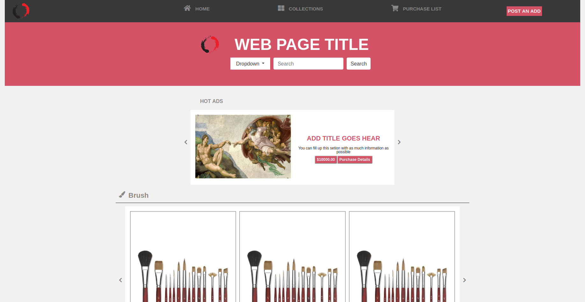
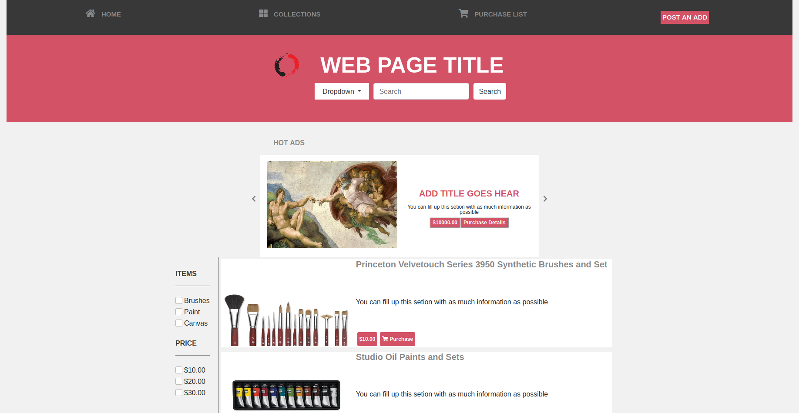
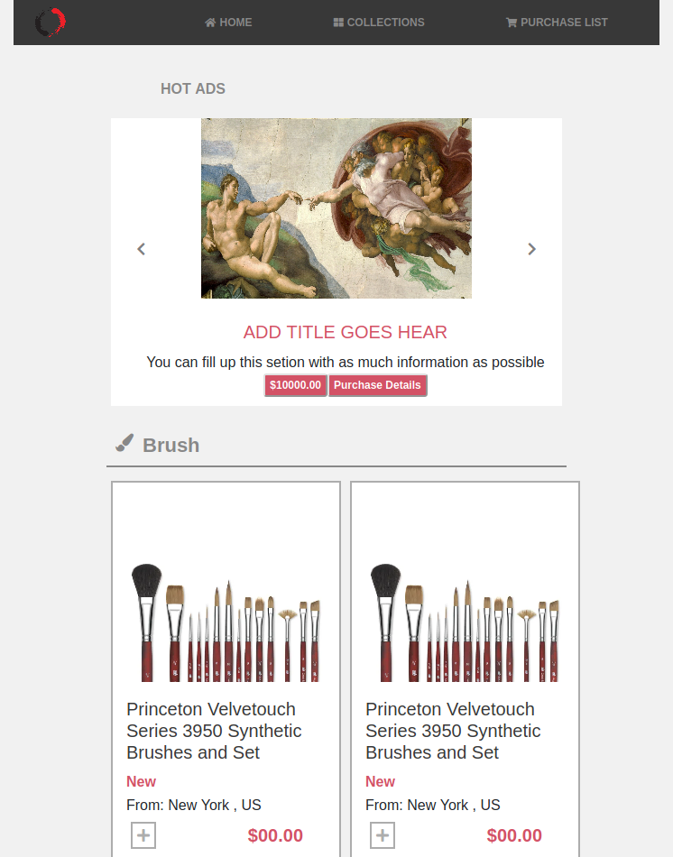
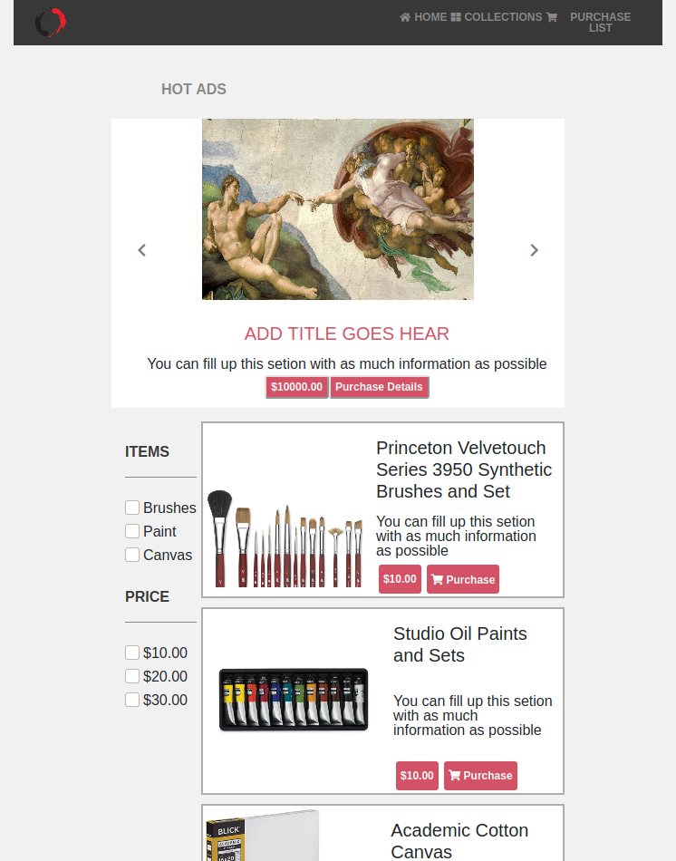

# Sale Page  directory - HTML AND CSS Capstone Project

> This project is the HTML and CSS capstone project, I built an art store  directory that allows users to scroll through items for sale, this project has 2 pages which are :

- The main page: the main page where all the items are displayed
- The search results page: This page displays the items in more of a narrow way regarding price points and items the customer is looking for. 


> The Desktop / Tablet version :
 




> The Mobile version :




## Built With

- HTML5
- CSS
- Font Awesome

## Live Demo

[Live Demo Link]( https://railona.github.io/Capstone-Project-HTML-CSS/ )


## Getting Started

To get a local copy up and running follow these simple example steps.

### Prerequisites

- Any internet browser (Firefox, Google Chrome, Opera...)

or 

- Live Server plugin for Visual Studio Code 

### Setup #1


1 - Download the code or copy the repository to your computer

2 - Run the index.html file


### Setup #2


1- Clone the repository
```
 $ git clone git@github.com:RailonA/Capstone-Project-HTML-CSS.git
```

2- Open the folder on VS Code, right-click the index.html file and click on "Open With Live Server"

3- Everything should be running by now. 

## Authors

👤 **Railon Acosta**

- GitHub: [@railonA](https://github.com/RailonA)
- Linkedin: [@railonAcosta](https://www.linkedin.com/in/railon-acosta-81265180/)
- Twitter: [@railonAcosta](https://twitter.com/RailonAcosta)


## ORIGINAL DESIGN INFORMATION
You can access all the design info (layouts) at this link:

[https://www.behance.net/gallery/24796463/ZATTIX](https://www.behance.net/gallery/24796463/ZATTIX)

Design idea by [Mohammed Awad on Behance](https://www.behance.net/M_Awad)

## 🤝 Contributing

Contributions, issues, and feature requests are welcome!

Feel free to check the [issues page](  https://github.com/RailonA/Capstone-Project-HTML-CSS/issues ).

## Show your support

Give a ⭐️ if you like this project!

## 📝 License

This project is [MIT](LICENSE) licensed.
